# DevOps & Workflow Documentation Framework

> **A portfolio showcase demonstrating my systematic approach to infrastructure management, deployment automation, and technical documentation. Such methods have already been applied in my previously handled projects, PoC Solution Demos, and PoC-to-Prod deployments**

---

## 🎯 Framework Philosophy
 
This framework represents a **documentation-first engineering approach** where every operational process, architectural decision, and deployment procedure is:

1. **Explicitly documented** — Allowing for ease of traceability and recovery
2. **Version-controlled** — All procedures evolve with the system, agent instructions are also provided to allow a historical changelog to be made; this is also used for developing codebase indexes (allowing Agent LLMs to quickly understand and navigate the codebase)
3. **Actionable** — Copy-paste ready commands with context
4. **Recoverable** — Every action has a rollback procedure

---

## 📐 Framework Architecture

```mermaid
flowchart TB
    subgraph Documentation["Documentation Layers"]
        direction TB
        ARCH["🏗️ Architecture Reference"]
        DEPLOY["🚀 Deployment Procedures"]
        OPS["⚙️ Operational Runbooks"]
        GUIDE["📘 Implementation Guides"]
    end
    
    subgraph Principles["Core Principles"]
        direction TB
        TRACE["Traceability"]
        RECOV["Recoverability"]
        AUTO["Automation"]
        SAFE["Safety First"]
    end
    
    ARCH --> DEPLOY
    DEPLOY --> OPS
    OPS --> GUIDE
    
    Principles -.-> Documentation
```



---

## 🧩 Framework Components

### 1. Infrastructure Architecture Documentation

**Purpose:** Provide a complete mental model of system topology

| Artifact | Contents |
|----------|----------|
| Container Structure | Volume mappings, mount points, service topology |
| Server Directories | Host filesystem layout, Docker volume locations |
| Network Topology | Port mappings, reverse proxy config, SSL/TLS |

**Key Pattern: Codebase Segregation**

The framework's architecture enables clear separation of concerns by categorizing each component of the project. This allows developers to:

- Quickly identify dependencies between components
- Understand the scope and responsibility of each module
- Navigate the codebase with minimal context-switching
- Isolate changes to specific areas without affecting unrelated components

> [!TIP]
> **Why This Matters:** When debugging "file not found" errors or permission issues, engineers can immediately trace host → container path relationships.

---

### 2. CI/CD Pipeline Documentation

**Purpose:** Enable safe, traceable, reversible deployments

```mermaid
flowchart LR
    subgraph Development
        COMMIT["Git Commit"]
    end
    
    subgraph CI["Continuous Integration"]
        BACKUP["📸 Backup SHA"]
        DIFF["📋 Show Changes"]
        DEPLOY["🚀 Deploy"]
    end
    
    subgraph Recovery
        ROLLBACK["↩️ Rollback"]
    end
    
    COMMIT --> BACKUP
    BACKUP --> DIFF
    DIFF --> DEPLOY
    DEPLOY -.->|"If broken"| ROLLBACK
```



**Key Features Demonstrated:**

| Feature | Implementation | Benefit |
|---------|----------------|---------|
| **Pre-deployment SHA capture** | Save commit hash before pulling | Instant rollback target |
| **Change preview** | `git diff --name-only HEAD origin/main` | Risk assessment before deploy |
| **Explicit rollback workflow** | Separate GitHub Action with confirmation | Panic-button recovery |
| **Multi-component isolation** | Separate repos for app vs. backend addons | Targeted rollbacks |

**Rollback Decision Matrix:**


---

### 3. Manual Operations Runbooks

**Purpose:** Bridging gap before full automation, some projects can not be automated immediately and workflow automation should be deployed over time

**Runbook Structure Pattern:**

```
1. ANNOUNCE → Notify team before changes
2. BACKUP → Create timestamped snapshot
3. LOG → Record in change log
4. EXECUTE → Make the change
5. VERIFY → Confirm functionality
6. ANNOUNCE → Notify completion status
```

**Example Team Communication Template:**

```markdown
🔧 STARTING WORK
File: [filename]
Module: [addon name]
What: [brief description]
ETA: [expected time]
```

> [!IMPORTANT]
> **Anti-Pattern Avoided:** "Works on my machine" syndrome. Every change is logged with backup reference, enabling any team member to rollback.

---

### 4. Data Migration & Transfer Guides

**Purpose:** Reproducible procedures for moving data between environments

> [!NOTE]
> The transfer methodology below prioritizes **compression and transfer speed** for large Docker images and data volumes. Depending on project complexity, security requirements, or compliance guidelines, alternative methods (such as encrypted transfers, staged syncs, or cloud-native migration tools) may be more appropriate.

**Transfer Methodology:**


**Key Patterns:**

| Pattern | Implementation | Purpose |
|---------|----------------|---------|
| **Resumable transfers** | `rsync --partial --append-verify` | Survive network interruptions |
| **Compression at source** | `pigz` parallel gzip | Reduce transfer time |
| **Integrity verification** | MD5/SHA checksum comparison | Confirm complete transfer |
| **Clear task checklists** | `- [ ]` markdown checkboxes | Track multi-step progress |

---

### 5. Implementation Guides

**Purpose:** Full-stack feature documentation from UI to database

**Documentation Depth:**

```
┌─────────────────────────────────────────────────────────────┐
│                    IMPLEMENTATION GUIDE                      │
├─────────────────────────────────────────────────────────────┤
│  📋 Architecture Overview (ASCII diagram)                    │
│  ↓                                                           │
│  🔄 Data Flow (step-by-step transformation)                  │
│  ↓                                                           │
│  💻 Code Examples (actual snippets)                          │
│  ↓                                                           │
│  🐛 Error Fixes (problem → cause → solution)                 │
│  ↓                                                           │
│  🗄️ Database Schema (field-level documentation)              │
│  ↓                                                           │
│  🔐 Security Considerations                                  │
│  ↓                                                           │
│  🚀 Future Enhancements                                      │
└─────────────────────────────────────────────────────────────┘
```

**Error Documentation Pattern:**

```markdown
### Error: "ECONNREFUSED" on Container Startup

**Problem:** Service attempted to connect before dependency was ready

**Root Cause:** Docker Compose `depends_on` only waits for container start, not service readiness

**Solution:**
- Implement health checks in `docker-compose.yml`
- Use wait-for scripts to check service availability
- Add retry logic with exponential backoff in application code
```

---

### 6. Agent LLM Templates

**Purpose:** Structured templates optimized for AI-assisted automation

GitHub issue and PR templates are designed to be **Agent-parseable**, enabling:

| Feature | Benefit |
|---------|---------|
| **Structured sections** | Token-efficient LLM parsing |
| **Type checkboxes** | Map directly to semantic versioning labels |
| **Consistent format** | Reduces context-switching overhead |
| **Changelog automation** | "Changes Made" section generates release notes |
| **Automated triage** | "Steps to Reproduce" enables root-cause analysis |

> **Why This Matters:** Structured templates allow Agent LLMs to automatically generate changelogs, categorize issues, and provide consistent documentation—reducing manual overhead and improving traceability.

