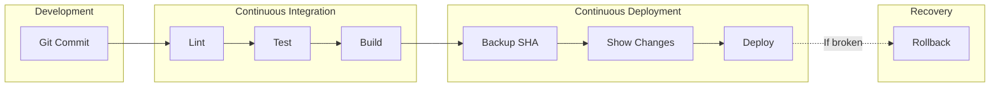

# CI/CD Pipeline Documentation

> **Purpose:** Enable safe, traceable, reversible deployments with automated workflows.

---

## Pipeline Philosophy

Every deployment should be:

1. **Traceable** — Know exactly what changed
2. **Reversible** — Rollback in seconds, not hours
3. **Automated** — Reduce human error
4. **Auditable** — Full history of who deployed what

---

## Pipeline Architecture



---

## GitHub Actions Workflows

### CI/CD Workflow (`ci.yml`)

Runs on every push to main with backup-first deployment:

| Stage | Purpose |
|-------|---------|
| **Validate** | Lint docs, validate Docker Compose, ShellCheck scripts |
| **Backup** | Capture current SHA before deploying (rollback point) |
| **Preview** | Show files that will change |
| **Deploy** | Execute deployment |
| **Save** | Store rollback point as artifact |

**Key Principle:** Every deployment saves the current state BEFORE pulling changes, enabling instant rollback.

### Rollback Workflow (`rollback.yml`)

Manual trigger with confirmation for safe rollback:

| Input | Purpose |
|-------|---------|
| `target_sha` | Commit to rollback to (empty = last stable) |
| `confirm` | Must type "ROLLBACK" to proceed |

**Process:**
1. Validates target commit exists
2. Previews files that will be restored
3. Executes rollback with `git checkout <sha>`
4. Rebuilds and restarts containers

---

## Deployment Flow

### Standard Deployment

```bash
# 1. Merge to main triggers CI
git push origin main

# 2. CI validates changes
# - Lint documentation
# - Validate Docker Compose
# - Check shell scripts

# 3. Manual deploy via GitHub Actions
# Actions → Deploy → Run workflow
```

### Manual Deployment

```bash
# SSH to server
ssh user@server

# Navigate to project
cd /opt/sample-project

# Capture current state
CURRENT_SHA=$(git rev-parse HEAD)
echo "Backup: $CURRENT_SHA"

# Pull latest changes
git fetch --all
git diff --name-only HEAD origin/main  # Preview
git reset --hard origin/main

# Restart services
docker compose -f docker-compose.yml -f docker-compose.prod.yml up -d
```

---

## Rollback Procedures

### Quick Rollback (Last Stable)

```bash
# Read last stable SHA
STABLE_SHA=$(cat /opt/backups/last-stable.txt)

# Rollback
cd /opt/sample-project
git checkout $STABLE_SHA

# Restart
docker compose restart
```

### Rollback to Specific Commit

```bash
# Find target commit
git log --oneline -10

# Rollback to specific SHA
git checkout <commit-sha>

# Restart
docker compose -f docker-compose.yml -f docker-compose.prod.yml up -d
```

### Single File Rollback

```bash
# Restore single file from previous commit
git checkout <commit-sha> -- path/to/file.py

# Restart affected service
docker compose restart web
```

---

## Rollback Decision Matrix

| Scenario | What Gets Rolled Back |
|----------|-----------------------|
| Single file changed | Only that file reverts |
| Multiple files changed | ALL modified files revert together |
| New file added | File is removed (untracked) |
| File deleted | File is restored |

---

## Environment Strategy

| Environment | Branch | Auto-Deploy | Approval |
|-------------|--------|-------------|----------|
| Development | `dev` | ✅ Yes | None |
| Staging | `staging` | ✅ Yes | None |
| Production | `main` | ❌ No | Required |

---

## Branch Protection Rules

| Rule | Setting | Rationale |
|------|---------|-----------|
| Require pull request | ✅ Enabled | No direct pushes to main |
| Require approvals | 1+ | Code review before merge |
| Require status checks | CI must pass | Prevent broken deployments |
| Require linear history | ✅ Enabled | Clean git log |
| Include administrators | ✅ Enabled | No bypass for anyone |

### Setup Steps

1. Go to Repository → Settings → Branches
2. Add rule for `main` branch
3. Enable protections listed above
4. Save changes

---

## Secrets Management

Store sensitive values as GitHub Secrets:

| Secret | Purpose |
|--------|---------|
| `DEPLOY_SERVER` | Server hostname/IP |
| `DEPLOY_PORT` | SSH port |
| `DEPLOY_USER` | SSH username |
| `SSH_PRIVATE_KEY` | SSH private key |

### Adding Secrets

1. Repository → Settings → Secrets and variables → Actions
2. New repository secret
3. Add name and value
4. Save

---

## Monitoring Deployments

### GitHub Actions

- View workflow runs in Actions tab
- Check job summaries for details
- Download artifacts for debugging

### Server Logs

```bash
# Application logs
docker logs -f sample-project-web-1 --tail 100

# All container logs
docker compose logs -f

# System logs
journalctl -u docker -f
```

---

## Troubleshooting

| Issue | Cause | Solution |
|-------|-------|----------|
| CI fails on push | Validation error | Check job logs, fix issues |
| Deploy hangs | SSH connection issue | Verify secrets, check firewall |
| Rollback doesn't work | Wrong SHA | Find correct SHA in git log |
| Container won't start | Config error | Check docker logs |
